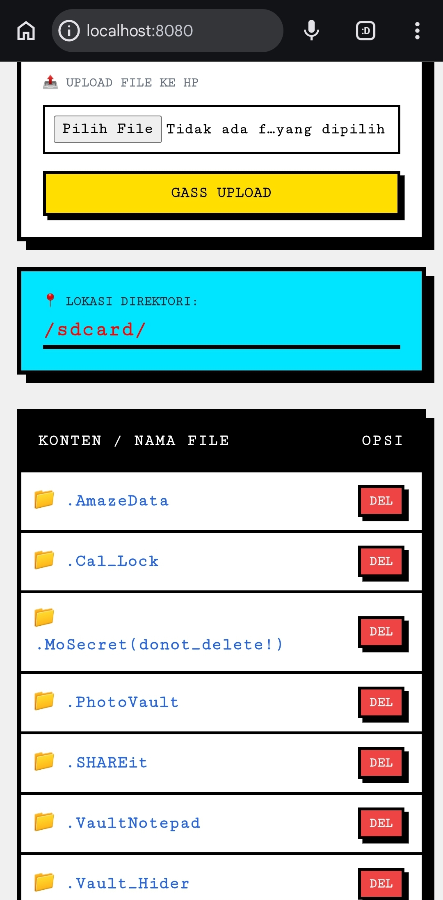

## 🚀 123 Drive Lite - Web File Manager

**123 Drive Lite** adalah pengelola file berbasis web yang dirancang khusus untuk dijalankan di **Termux**. kamu bisa mengelola file internal storage HP kamu langsung dari browser di perangkat mana saja (Laptop/PC/HP lain) dengan kecepatan transfer yang ngebut!

---

## 🔥 Fitur Utama (Standard Version)
- **⚡ Fast File Explorer:** Navigasi folder storage Android dengan instan.
- **📁 Basic Operations:** Copy, Move, Rename, dan Delete file/folder.
- **📤 Easy Upload & Download:** Transfer file antar perangkat tanpa kabel data.
- **🖼️ Media Preview:** Lihat foto dan putar video langsung di browser.
- **🌐 Localhost & IP Access:** Akses via `localhost:8080` atau alamat IP lokal.

## 🚀 Demo
> Berikut adalah cuplikan tampilan :
>
> 

---

## 🛠️ Cara Instalasi

Buka Termux , lalu jalankan perintah :
```bash
git clone [https://github.com/123tool/123-Drive-Lite.git]
cd 123-Drive-Lite
chmod +x install.sh
./install.sh
```
## Menjalankan Server:
​Setelah instalasi selesai, cukup ketik :
```
node server.js
```
## Lalu buka browser di alamat :
​Di HP yang sama : 
```
http://localhost:8080
```
​Di Laptop/Perangkat Lain :
```
http://[IP-HP-KAMU]:8080
```
Cari Tahu IP HP ​Di Termux, kamu ketik perintah ini:
```
ifconfig
```
Cari bagian wlan0 (kalau pakai WiFi/Hotspot). 
Di bawahnya ada tulisan inet. Nah, angka di sebelah inet itu adalah IP kamu.

Contoh : 
```
192.168.1.5 atau 192.168.43.1.
```
## Pastikan Satu Jaringan
​HP yang jalanin Termux dan Laptop/HP yang mau akses harus konek ke WiFi yang sama.

​Tips :

Kalau nggak ada WiFi, kamu nyalain Hotspot di HP Termux kamu, terus Laptop kamu konek ke Hotspot itu.
Itu cara paling stabil.
​
## Cara Aksesnya :

​Misal IP yang kamu dapet tadi 
```
192.168.43.1
```
maka di browser laptop kamu ketik :
```
http://192.168.43.1:8080
